# Looped Transformer 实验进展报告
## 实验模式
交织成 (x_1, y_1, x_2, y_2, ..., x_k, y_k)，根据历史的（x_1, y_1, ..., x_i）预测 y_i
## 基础配置
```python
manual_config=dict(
    batch_size=64,
    num_blocks=20,
    num_eff=15,
    d_model=256,
    num_heads=8,
    pe_type=['learned_ape'],
    x_init='zero',
    init_std='auto',
    residual_gate=(1, 1),
    residual_gate_type='fixed',
    optimizer_type='adamw', 
    lr=1e-3,
    layer_weight_decay=1.0,  
    seq_weight_decay=1.0,       
    scheduler_type='cosine',  
)
```
## Curriculum Learning
**Curriculum Learning** 是原论文在训练阶段引入的一种渐进式训练策略，使模型从简单的低维和短序列开始学习，逐步过渡到更复杂的高维和长序列。
### 线性和非线性回归任务
#### 基础配置
```python
d_x=20,
seq_len=80,  
epochs=50,
steps_per_epoch=200,
```
#### 实验配置
```python
params_groups=[
    {
        'experiment_name': 'Without Curriculum (Hard Mode)',
        'curriculum': {} #
    },
    {
        'experiment_name': 'With Curriculum (Perfect Path)',
        'curriculum': {
            'd_x': 5, 
            'seq_len': 10, 
            'duration_ratio': 0.8 # 前 80% 的 epochs 内逐步过渡到完整序列
        }
    }
]
results_lists = [
    (['1_ID_Baseline_sink_scores','2_OOD_Scale_x2_sink_scores', '3_OOD_Seq_Extrapolation_sink_scores'], 'block'),
    (['1_ID_Baseline_y_norm_ratio', '2_OOD_Scale_x2_y_norm_ratio', '3_OOD_Seq_Extrapolation_y_norm_ratio'], 'experiment'),
    (['1_ID_Baseline_loss', '2_OOD_Scale_x2_loss', '3_OOD_Seq_Extrapolation_loss'], 'experiment')
]
eval_configs = [
    {'eval_name': '1_ID_Baseline', 'ood_kwargs': {}}, # 分布内基准
    {'eval_name': '2_OOD_Scale_x2', 'ood_kwargs': {'x_scale': 2.0}}, # X 尺度放大
    {'eval_name': '3_OOD_Seq_Extrapolation', 'ood_kwargs': {'seq_len_scale': 1.2}} # 序列长度外推
]
```
#### 线性回归
##### 数据
y_i = x_i @ W ，其中 W 是一个每批次随机生成的权重矩阵。
##### 实验结果
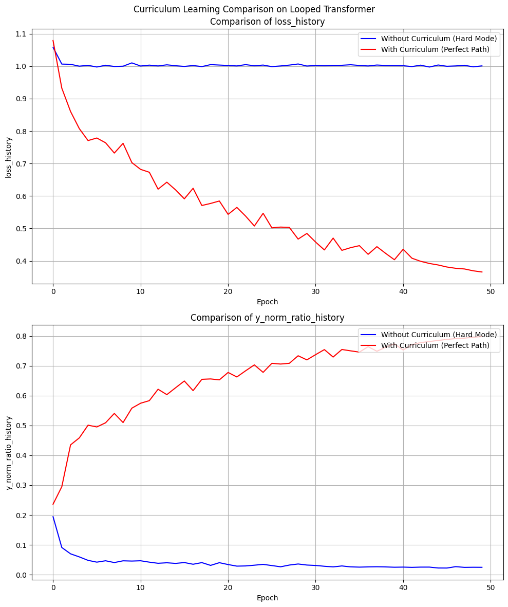
##### 结果分析
- 在线性回归任务中，如果不使用 Curriculum Learning，模型在训练初期会陷入一个全猜0的局部极小值，Loss 长时间停滞在1.0附近，$Norm Ratio = ||y_{true}|| / ||y_{pred}||$ 收敛于0.0，表明模型完全没有学到有效的映射关系。
- 引入 Curriculum Learning 后，模型能够逐步适应更长的序列和更高维度的数据，Loss 稳步下降，Norm Ratio 也逐渐上升。在curriculum结束后的 20% 的 epochs 内，Loss 和 Norm Ratio 的下降不再波动，变得平滑，表明模型学会了正确的线性映射关系。
##### 评估结果
包含两个实验的 sink score 随层深的演化折线图，以及 ID 与两种 OOD 场景下 Loss 与 Norm Ratio 的对比图。
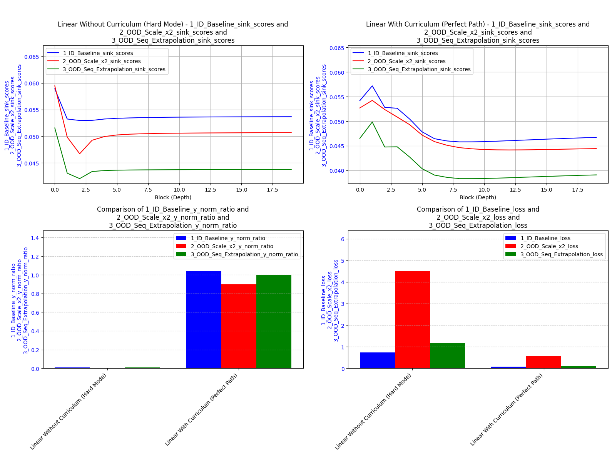
#### 非线性回归
##### 数据
y_i = 2**0.5 * relu(x_i @ W_1) @ W_2，其中 W_1、W_2 是每批次随机生成的权重矩阵和偏置向量。
##### 实验结果
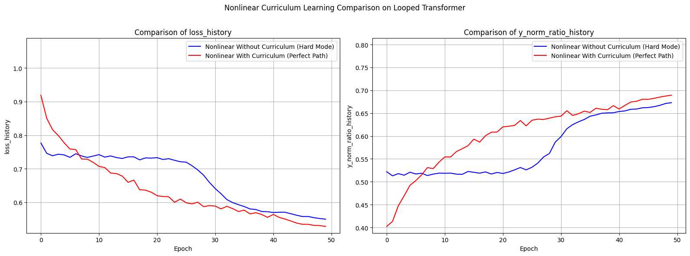
##### 结果分析
- 在非线性回归任务中，模型在没有 Curriculum Learning 的情况下，在前半段时间内只学会了部分规律，Loss 在0.74附近震荡，Norm Ratio 在0.52左右徘徊，停滞不前；而在后半段时间内，模型突然顿悟，Loss 开始平滑稳定地下降，Norm Ratio 也迅速上升，表明模型在某个临界点（25～30epochs处，合5000～6000 steps）上成功解开了非线性映射关系。
- 引入 Curriculum Learning 后，模型能够更早地适应非线性关系，Loss 和 Norm Ratio 的下降更加平滑稳定，没有明显的顿悟现象，表明模型在整个训练过程中都在持续地学习和优化非线性映射关系。
##### 评估结果
包含两个实验的 sink score 随层深的演化折线图，以及 ID 与两种 OOD 场景下 Loss 与 Norm Ratio 的对比图。
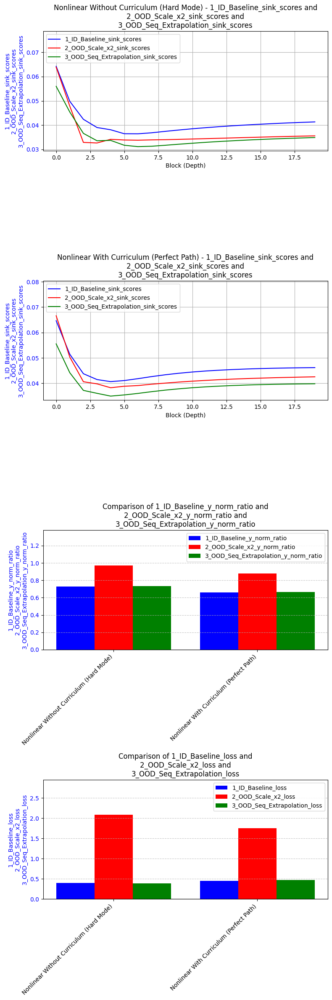
### Lorenz Attractor
#### 基础配置
```python
d_x=3,
d_y=3,
seq_len=300,  
epochs=50,
steps_per_epoch=50,
optimizer_type='muon_adamw',
lorenz_kwargs=dict(dt=0.01, burn_in=500)
```
#### 实验配置
```python
param_groups = [
    {
        'experiment_name': 'Lorenz Without Curriculum (Hard Mode)',
        'curriculum': {}          # 关闭课程学习，一上来就啃 150 步长序列
    },
    {
        'experiment_name': 'Lorenz With Curriculum (Perfect Path)',
        # 删除了'd_x' 渐变（因为d_x固定为3），仅对时序步长进行课程演进
        'curriculum': {
            'seq_len': 20,        # 课程从极短的 20 步（10对点）开始，降低初始积分关联难度
            'duration_ratio': 0.8 # 前 30 个 epoch 随着线性进度逐步拉长到 150 步
        }
    }
]
```
#### 公式
洛伦兹系统的微分方程：
$$\dot{x} = \sigma(y - x), \dot{y} = x(\rho - z) - y, \dot{z} = xy - \beta z$$
其中 $\sigma=10, \rho=28, \beta=8/3$。
#### 数据
在数据生成中，通过rk4方法生成一段trajectory（记为r_1,...,r_k），x=(r_1, r_2, ..., r_k-1)，y=(r_2, r_3, ..., r_k)。d_x = 3，d_y = 3。模型的输入输出都是三维空间中的点序列，目标是学习从当前状态单步预测下一个状态的映射关系。配置为 dt = 0.01，burn_in = 500(丢弃前 500 步的初始过渡态)
#### 实验结果
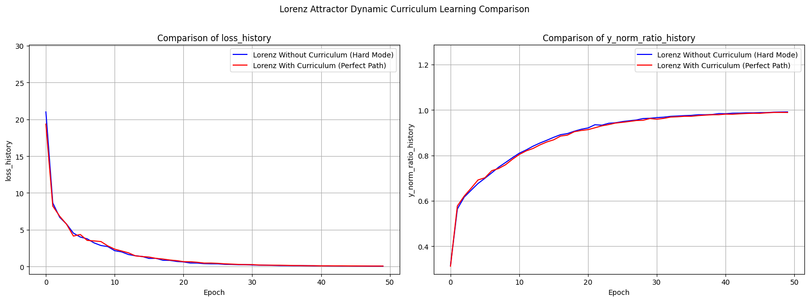
#### 结果分析
- 在洛伦兹系统的实验中，模型不管是否使用 Curriculum Learning，都能快速在1000 steps 内将 Loss 降到 0.1 以下，Norm Ratio 提升到 0.9 以上，但 Curriculum Learning 的引入使得模型训练效率大幅提升，取得同样的性能只需一半多一点的训练时间（因为seq_len小的时候训练耗时更短）。
#### 评估结果
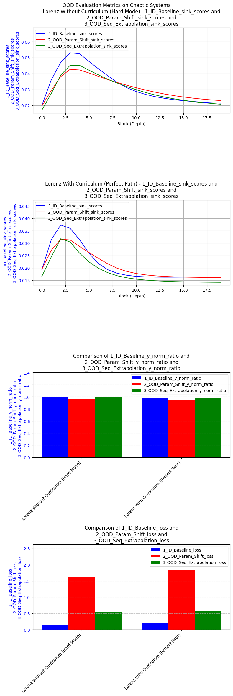

观察发现，Lorenz Attractor 任务中，sink score 的层深依赖曲线和上面的线性、非线性回归任务不同，呈现出在第 3～4 层出现一个明显的峰值，之后深层的 sink score 反而回落。
### 统一作图分析

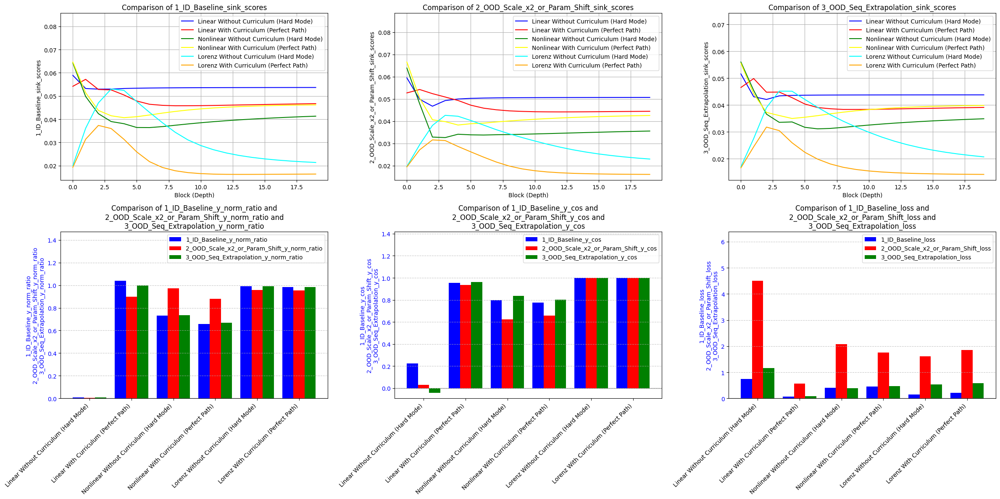
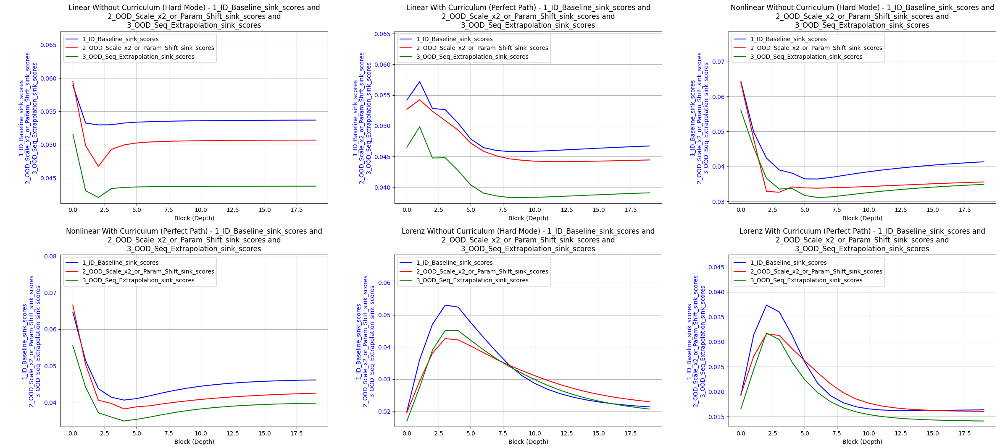
## Lorenz Attractor 任务的多步 rollout 评估分析
### 实验配置
- 150 步长的序列输入，模型完全自回归地盲推 1000 步，评估模型是否学会了混沌流形
- 采用已训练5000 steps 的模型（此时 Loss 已经稳定在 0.01 以下，Norm Ratio 稳定在 0.9999 以上），分别在 ID 和 OOD 场景下进行评估，OOD 场景包括参数偏移（rho_shift=5.0，也就是 $rho$ 从 28 变为 33）。
### 结果分析
#### In Distribution 评估
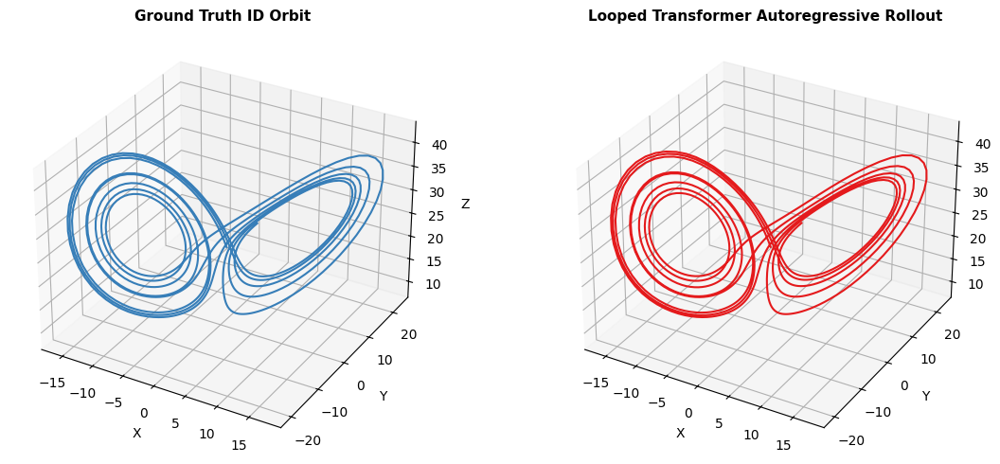

可以看到，在 ID 场景下，模型能够非常准确地预测出混沌流形的轨迹，生成的轨迹与真实轨迹几乎一模一样，表明模型成功学会了洛伦兹系统的动力学规律。
#### Out of Distribution 评估
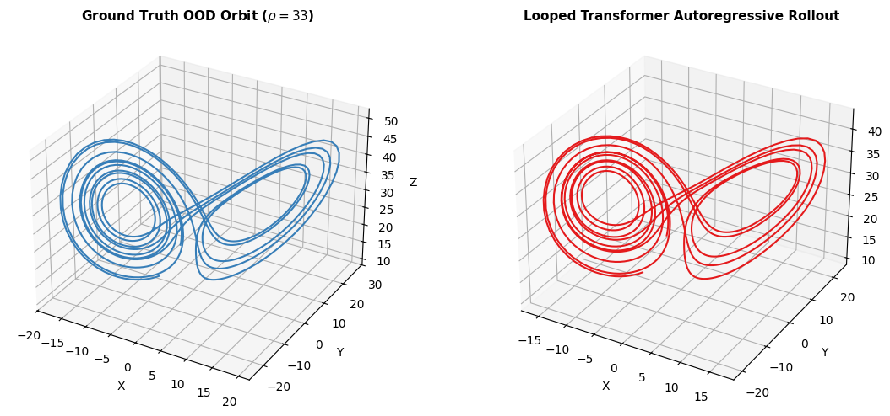

可以看到，形状仍然是光滑的蝴蝶翅膀流形，与ID场景下的轨迹非常相似，但是由于 $rho$ 的偏移，真实流形的尺度发生了明显的变化，模型生成的轨迹在尺度上明显比真实流形偏小，和ID场景的轨迹更接近，表明模型学会了洛伦兹系统的动力学规律，但对参数偏移的泛化能力有限。
#### 对缺乏长期训练（只训练了不到1000 steps）的模型进行同样的评估
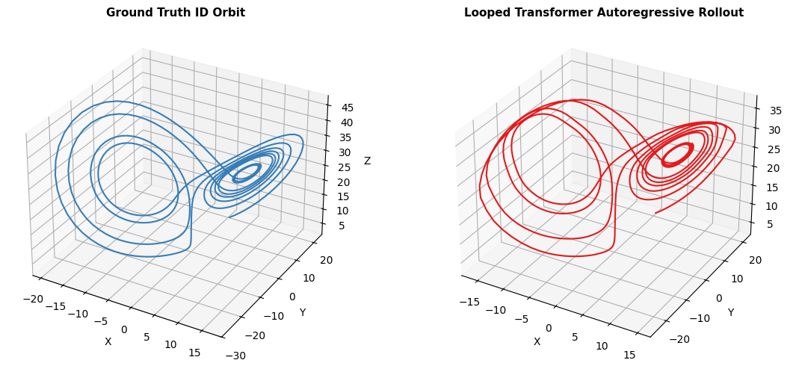
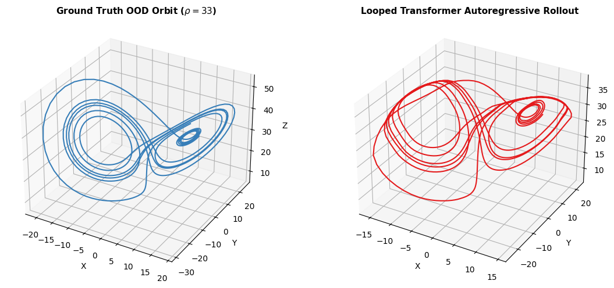

可以看到，早期模型生成的轨迹也是蝴蝶翅膀的形状，在远离边界的区域与真实轨迹较为接近，但在边界附近发生了生硬的转折，尤其是在 OOD 场景下，好像把OOD的边界外真实三维数据“投影”到了ID的边界上，有明显的$C^1$不连续现象。