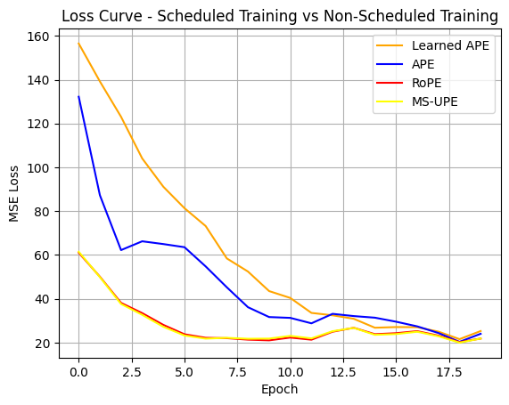
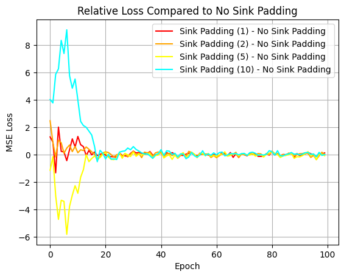

# Looped Transformer：机制消融与动力学分析

对 **Looped Transformer**（所有层共享权重、循环迭代的 Transformer 变体）进行穷尽式机制消融的实验框架。在上下文线性回归任务上，完成了位置编码、残差门控、Sink Padding、计划训练等多项对比实验。

## 目录

1. [理论](#理论)
  - 1.1. [截断损失函数](#截断损失函数)
  - 1.2. [下游任务：线性回归](#下游任务线性回归)
2. [模块拼装](#模块拼装)
3. [目录结构](#目录结构)
4. [快速启动](#快速启动)
5. [实验框架：ExperimentTable](#实验框架-experimenttable)
  - 5.1. [核心流程](#核心流程)
  - 5.2. [参数速查](#参数速查)
    - 5.2.1. [`__init__` 参数](#init-参数)
    - 5.2.2. [`run` 参数](#run-参数)
    - 5.2.3. [`plot` 参数](#plot-参数)
    - 5.2.4. [可覆写参数一览](#可覆写参数一览)
    - 5.2.5. [可用指标一览](#可用指标一览)
  - 5.3. [括号语法速查](#括号语法速查)
    - 5.3.1. [`params_groups` 格式](#params_groups-格式)
    - 5.3.2. [`result_lists` 格式](#result_lists-格式)
  - 5.4. [绑图逻辑详解](#绑图逻辑详解)
    - 5.4.1. [横向对比模式](#横向对比模式)
    - 5.4.2. [独立模式](#独立模式)
    - 5.4.3. [总图数公式](#总图数公式)
    - 5.4.4. [怎么看图](#怎么看图)
  - 5.5. [常见报错](#常见报错)
6. [已完成的实验](#已完成的实验)
  - 6.1. [Scheduled Training vs Non-Scheduled](#1-scheduled-training-vs-non-scheduled)
  - 6.2. [位置编码对比](#2-位置编码对比5-种-pe)
  - 6.3. [Sink Padding 消融](#3-sink-padding-消融)
  - 6.4. [残差门控消融](#4-残差门控消融)
7. [依赖](#依赖)
8. [待完成与未来工作](#待完成与未来工作)
  - 8.1. [A. 开箱即用](#a-开箱即用)
    - 8.1.1. [全参数扫描](#全参数扫描)
  - 8.2. [B. 少量扩展](#b-少量扩展)
    - 8.2.1. [两处 pass 补全](#两处-pass-补全)
    - 8.2.2. [首 loss 归一化](#首-loss-归一化)
    - 8.2.3. [分头 attention 可视化](#分头-attention-可视化)
    - 8.2.4. [泛化能力测试（OOD）](#泛化能力测试ood)
    - 8.2.5. [非线性回归](#非线性回归)
    - 8.2.6. [模型探针](#模型探针)
    - 8.2.7. [优化与正则化](#优化与正则化)
    - 8.2.8. [Grokking 观察](#grokking-观察)
  - 8.3. [C. 新模块开发](#c-新模块开发)
    - 8.3.1. [画梯度下降图](#画梯度下降图)
    - 8.3.2. [添加归纳偏置](#添加归纳偏置)
    - 8.3.3. [新任务扩展](#新任务扩展)
    - 8.3.4. [ExperimentTable GUI](#experimenttable-gui)

---

## 理论

Looped Transformer 的所有层共享同一组权重 $\theta$，每层的输入是前一层输出与初始输入的加权组合：

$$
\begin{aligned}
h_0 &= \text{input} \\
h_l &= \text{TransformerBlock}(a \cdot h_{l-1} + b \cdot h_0 \mid \theta) \quad l=1,2,...,L
\end{aligned}
$$

其中 $(a, b)$ 为**残差门控参数**，控制当前状态与原始输入之间的信息流。

### 截断损失函数

为防止梯度在多轮迭代中爆炸，只让最后 $T$ 层参与损失计算与梯度回传：

$$\text{Loss}(\theta)=\mathbb{E}_P \left[ \frac{1}{b - b_0} \sum_{t = b_0}^{b} \frac{1}{k + 1} \sum_{i = 0}^{k} (Y_t(P^i \mid \theta) - f(x_{i+1}))^2 \right]$$

- $b$：总迭代层数，$b_0 = \max(b - T, 0)$，$T$ 即有效层数 `num_eff`
- $P^i$：包含前 $i$ 对 $(x, y)$ 的 prompt 前缀
- $Y_t(P^i \mid \theta)$：第 $t$ 次迭代时模型的输出

### 下游任务：线性回归

- **维度**：$d = 20$，上下文样本数 $k = 40$
- **数据生成**：每轮采样真实权重 $w \sim \mathcal{N}(0, I_d)$，生成 $y_i = w^T x_i$
- **Prompt 格式**：交织序列 $(x_1, y_1, x_2, y_2, \dots, x_k, y_k, x_{test}, y_{dummy})$
- **预测位置**：取最后一层输出的倒数第二个 token（索引 `[-2]`），即 $x_{test}$ 对应的位置
- **双通道映射**：$x$ 和 $y$ 分别通过独立的线性层投影到 256 维，再"拉链式"交织拼接

---

## 模块拼装

```
Looped Transformer 实验台
├── 位置编码 (Position Encoding) — position_encoding.py
│   ├── APE              — 绝对位置编码，直接生成 sin/cos 矩阵加到输入端
│   ├── LearnedAPE       — 可学习位置编码，使用 nn.Embedding
│   ├── ALiBi            — 线性偏置注意力，在 score 矩阵上减去距离惩罚（不加在输入端）
│   ├── RoPE             — 旋转位置编码，在 MHA 内部对 Q、K 做旋转变换
│   └── MS_UPE           — 自创多尺度解绑位置编码，对 Q/K 加法注入，每头不同基频
├── MultiHeadAttention — attention.py
│   — 因果注意力，支持多种 PE 分发，内置注意力矩阵捕获 hook
├── TransformerBlock — transformer_block.py
│   — Pre-Norm (LayerNorm/RMSNorm) + MHA + FFN (GELU/SwiGLU) + 两层残差
├── ToyModel — toy_model.py
│   — Looped Transformer 引擎，权重共享、残差门控 (a*x + b*x_0)、num_eff 截断
├── AttentionProbe — toy_model.py
│   — 基于 PyTorch Hook 无感截取各层注意力权重
├── RegressionHead — regression.py
│   — 双通道 (x/y) 线性投影 + 交织 prompt 构造
├── PredictionLoss — regression.py
│   — MSE/L1 损失 + read_out 投影 + sink padding 遮蔽
├── RegressionSolver — regression.py
│   — 端到端网络：Head + ToyModel + Loss 拼装
├── 数据流水线 — data.py
│   ├── linear_data_generator — 随机线性函数 y = x @ w 生成器
│   └── dataloader            — 无限 Batch 流 + 可选 sink padding
├── LoopedTransformerExperiment — experiment.py
│   — 单实验驾驶舱（训练、评估、收指标、显存管理）
├── ExperimentTable — experiment_table.py
│   — 多实验调度器，支持并行压测 + 自动绑图
├── default_setup() — parameters.py
│   — 集中管理的默认超参数字典
└── print_vram_usage() — experiment.py
    — 跨平台 (MPS/CUDA) 显存监控
```

---

## 目录结构

```
Looped_Transformer/
├── src/
│   ├── looped_transformer/               # 核心包
│   │   ├── __init__.py                   # 统一导出所有类/函数
│   │   ├── position_encoding.py          # → 无内部依赖
│   │   ├── attention.py                  # → 依赖 position_encoding
│   │   ├── transformer_block.py          # → 依赖 attention
│   │   ├── toy_model.py                  # → 依赖 transformer_block
│   │   ├── regression.py                 # → 依赖 toy_model
│   │   ├── data.py                       # → 无内部依赖
│   │   ├── experiment.py                 # → 依赖 regression, data
│   │   ├── experiment_table.py           # → 依赖 experiment, parameters
│   │   └── parameters.py                 # → 无内部依赖
│   └── main.py                           # 入口脚本
├── figures/                              # 实验输出图片
│   ├── PE对比.png
│   ├── scheduled vs non-scheduled.png
│   ├── sink_padding对比实验.png
│   ├── residual_gate loss对比.png
│   └── residual_gate relative changes.png
├── Looped_Transformer.ipynb              # 原始 notebook（代码同上，含实验输出）
├── Looped_Transformer.pdf                # 转换自 .ipynb, 适合离线阅读
├── requirements.txt
└── README.md
```

**包内依赖链**：`position_encoding → attention → transformer_block → toy_model → regression → experiment → experiment_table`，`data` 和 `parameters` 为独立叶子模块。

**运行方式**：`python src/main.py`（从项目根目录执行）

每个模块对应的类/函数及 notebook 区域见[模块拼装](#模块拼装)。

---

## 快速启动

所有代码均在 `Looped_Transformer.ipynb` 中。参数说明见 [`params_groups` 中的常用 key](#params_groups-中的常用-key)。依次运行以下 cell 即可验证环境：

```python
# 1. 创建实验台，跑一个基线实验
table = ExperimentTable(params_groups=[{'experiment_name': '基线实验'}])

# 2. 训练（单线程）
table.run(result_lists=[(['loss_history'], 'epoch')])

# 3. 画图
table.plot(figure_size=(8, 6))
```

复现位置编码对比实验：

```python
table = ExperimentTable(params_groups=[
    {'pe_type': ['learned_ape'], 'experiment_name': 'Learned APE'},
    {'pe_type': ['ape'],         'experiment_name': 'APE'},
    {'pe_type': ['alibi'],       'experiment_name': 'ALiBi'},
    {'pe_type': ['rope'],        'experiment_name': 'RoPE'},
    {'pe_type': ['ms_upe'],      'experiment_name': 'MS-UPE'},
])
table.run(result_lists=[(['loss_history'], 'epoch')], parallel_workers=2)
table.plot(figure_size=(8, 6))
```

---

## 实验框架：ExperimentTable

`ExperimentTable` 是多实验对比的核心调度器。传入一组参数字典，自动跑完所有实验、收集指标、生成对比图。

### 核心流程

1. **`__init__(params_groups, manual=None)`** — 加载默认参数，逐实验覆盖。见[参数速查](#参数速查)
2. **`run(result_lists, modes=['train'], parallel_workers=1)`** — 执行实验
3. **`plot(...)`** — 渲染对比图

底层逻辑是"全量默认 + 局部覆写"：所有参数都有 `default_setup()` 提供的默认值，你只需在 `params_groups` 中指定要改的那几个。

### 参数速查

#### `__init__` 参数

| 参数 | 类型 | 默认值 | 说明 |
|------|------|--------|------|
| `params_groups` | `list[dict]` | **必填** | 每个 dict 是一个实验的配置，未填的 key 走默认值。格式见[括号语法速查](#括号语法速查)，可覆写参数见[可覆写参数一览](#可覆写参数一览) |
| `manual` | `dict` 或 `None` | `None` | 全局参数覆盖，作用于所有实验（在逐实验覆盖之前应用） |

#### `run` 参数

| 参数 | 类型 | 默认值 | 说明 |
|------|------|--------|------|
| `result_lists` | `list[tuple]` | **必填** | 格式见[括号语法速查](#括号语法速查)，合法指标见[可用指标一览](#可用指标一览) |
| `modes` | `list[str]` | `['train']` | `'train'` 和/或 `'evaluate'` |
| `parallel_workers` | `int` | `1` | 并行线程数，必须为正整数。大于 1 开启多线程压测 |

#### `plot` 参数

| 参数 | 类型 | 默认值 | 说明 |
|------|------|--------|------|
| `compare_experiments` | `bool` | `True` | `True`：所有实验的同一指标画在同一张图上横向对比。`False`：每个实验独立成图 |
| `subplot_shape` | `tuple` | `(1, -1)` | 子图行列数。`-1` 表示自动计算。如 `(-1, 2)` = 每行 2 列 |
| `figure_size` | `tuple` | `(15, 10)` | 画布尺寸（英寸） |
| `suptitle` | `str` | `'Looped...'` | 整张大图的标题 |
| `colors` | `list[str]` | 8 色循环 | 线条颜色，按实验序号循环使用 |

#### 可覆写参数一览

所有可覆写参数默认值见 `default_setup()`，按模块分组如下：

##### 初始化参数 (`init_parameters`)

###### RoPE / MS-UPE

| Key | 类型 | 默认值 | 说明 |
|-----|------|--------|------|
| `b_rope_or_upe` | `float` | `10000` | RoPE 或 UPE 的基数 |
| `head_ratio_upe` | `float` | `2` | UPE 头比例 |

###### MultiHeadAttention

| Key | 类型 | 默认值 | 说明 |
|-----|------|--------|------|
| `num_heads` | `int` | `8` | 注意力头数 H |
| `d_model` | `int` | `256` | Transformer 的维度 D |
| `max_seq_len` | `int` | `100` | 模型支持的最大序列长度（位置编码相关） |
| `pe_type` | `list[str]` | `['learned_ape']` | 位置编码类型：`'ape'`、`'learned_ape'`、`'rope'`、`'ms_upe'`、`'alibi'`，可组合如 `['ms_upe', 'learned_ape']` |

###### TransformerBlock

| Key | 类型 | 默认值 | 说明 |
|-----|------|--------|------|
| `norm_type` | `str` | `'layernorm'` | 归一化类型：`'layernorm'` 或 `'rmsnorm'` |
| `ffn_type` | `str` | `'gelu'` | 前馈网络激活函数类型：`'gelu'` 或 `'swiglu'` |

###### ToyModel

| Key | 类型 | 默认值 | 说明 |
|-----|------|--------|------|
| `num_blocks` | `int` | `20` | Transformer 的层数 b |
| `loop` | `bool` | `True` | 是否权重共享 |
| `residual_gate` | `tuple` 或 `str` | `(1, 1)` | 残差门控参数初始值，使 `x = a*x + b*x_0`。`(a, b)` 元组或 `'random'`（高斯初始化） |
| `residual_gate_type` | `str` | `'fixed'` | 残差门控类型：`'fixed'`、`'learnable_scalar'`、`'learnable_vector'` |
| `residual_random` | `tuple` | `(1, 0.1)` | `(mean, std)`，当 `residual_gate='random'` 时满足高斯分布 N(mean, std) |

###### RegressionHead

| Key | 类型 | 默认值 | 说明 |
|-----|------|--------|------|
| `d_x` | `int` | `20` | 数据输入的特征维度 |
| `d_y` | `int` | `1` | 数据输出的特征维度 |
| `bias` | `bool` | `False` | Regression Head 是否使用偏置 |
| `init_scale` | `float` 或 `None` | `None` | Regression Head 的初始化缩放因子（`None` 表示使用默认初始化） |

###### PredictionLoss

| Key | 类型 | 默认值 | 说明 |
|-----|------|--------|------|
| `loss_type` | `str` | `'mse'` | 损失函数类型：`'mse'` 或 `'l1'` |

###### LoopedTransformerExperiment

| Key | 类型 | 默认值 | 说明 |
|-----|------|--------|------|
| `lr` | `float` | `1e-4` | 学习率 |
| `gate_lr_ratio` | `float` | `100` | 门控参数的学习率相对于模型其他参数的倍数 |
| `seed` | `int` 或 `None` | `42` | 随机种子，确保实验可复现 |
| `experiment_name` | `str` 或 `None` | `'Experiment'` | 实验名称，同时用作绑图时的图例名（`None` 表示不打印设备和实验初始化信息） |
| `timing` | `bool` | `True` | 是否打印初始化时间 |
| `optimizer_type` | `str` | `'adam'` | 优化器类型：`'adam'`、`'sgd'` 或 `'adamw'` |
| `task` | `str` | `'regression'` | 任务类型（目前仅 `'regression'`） |

##### 训练参数 (`train_parameters`)

###### MultiHeadAttention

| Key | 类型 | 默认值 | 说明 |
|-----|------|--------|------|
| `batch_size` | `int` | `64` | 数据批次大小 |
| `seq_len` | `int` | `80` | 数据序列长度（实际 k = seq_len/2） |

###### ToyModel

| Key | 类型 | 默认值 | 说明 |
|-----|------|--------|------|
| `num_eff` | `int` | `15` | 有效层数，即参与误差计算、参与梯度反向传播的层数 T = b - b_0 |

###### dataloader

| Key | 类型 | 默认值 | 说明 |
|-----|------|--------|------|
| `sink_padding` | `int` 或 `None` | `None` | seq 最前面填充的 sink token 组数（`None` 表示不使用 sink padding） |

###### LoopedTransformerExperiment

| Key | 类型 | 默认值 | 说明 |
|-----|------|--------|------|
| `epochs` | `int` | `20` | 训练轮数 |
| `data_type` | `str` | `'linear'` | 回归数据类型（目前仅 `'linear'`） |
| `scheduler_type` | `str` 或 `None` | `None` | 学习率调节器类型：`'cosine'` 或 `None` |
| `scheduled_training` | `bool` | `True` | 是否使用计划训练，即随着训练进行逐渐增加参与层数 `b = epoch + num_eff`，直到达到 `num_blocks` |
| `print_every` | `int` 或 `None` | `5` | 打印频率（每 N 个 epoch 打印一次；`None` 表示不打印） |
| `timing` | `bool` | `True` | 是否打印训练时间 |

#### 可用指标一览

以下是 `result_lists` 中可用的所有合法指标名，来自 `LoopedTransformerExperiment.get_results()` 的返回值。

##### 训练过程指标（横轴：`'epoch'`）

| 指标 Key | 类型 | 说明 |
|----------|------|------|
| `loss_history` | `list[float]` | 每个 epoch 的 MSE 损失 |
| `residual_gate_history_a` | `list[float]` | 每个 epoch 的门控 a 值（仅标量模式） |
| `residual_gate_history_b` | `list[float]` | 每个 epoch 的门控 b 值（仅标量模式） |
| `residual_gate_history_a_relative` | `list[float]` | 门控 a 值相对初始值的变化量 |
| `residual_gate_history_b_relative` | `list[float]` | 门控 b 值相对初始值的变化量 |
| `residual_gate_history_a_mean` | `list[float]` | 每个 epoch 的门控 a 向量均值（仅向量模式） |
| `residual_gate_history_b_mean` | `list[float]` | 每个 epoch 的门控 b 向量均值（仅向量模式） |
| `residual_gate_history_a_mean_relative` | `list[float]` | 门控 a 向量均值相对初始值的变化量 |
| `residual_gate_history_b_mean_relative` | `list[float]` | 门控 b 向量均值相对初始值的变化量 |
| `residual_gate_history_a_std` | `list[float]` | 每个 epoch 的门控 a 向量标准差（仅向量模式） |
| `residual_gate_history_b_std` | `list[float]` | 每个 epoch 的门控 b 向量标准差（仅向量模式） |

##### 汇总指标（横轴：`'experiment'`）

| 指标 Key | 类型 | 说明 |
|----------|------|------|
| `final_loss` | `float` | 最终 epoch 的损失值 |
| `final_residual_gate_a` | `float` | 最终门控 a 值（标量模式） |
| `final_residual_gate_b` | `float` | 最终门控 b 值（标量模式） |
| `final_residual_gate_a_mean` | `float` | 最终门控 a 向量均值（向量模式） |
| `final_residual_gate_b_mean` | `float` | 最终门控 b 向量均值（向量模式） |
| `final_residual_gate_a_std` | `float` | 最终门控 a 向量标准差（向量模式） |
| `final_residual_gate_b_std` | `float` | 最终门控 b 向量标准差（向量模式） |
| `init_time` | `float` | 实验初始化耗时（秒） |
| `train_time` | `float` | 训练耗时（秒） |
| `captured_attention` | `list[ndarray]` | 各层捕获的注意力权重矩阵 |

### 括号语法速查

`ExperimentTable` 的嵌套括号是最高频的报错来源。直接复制以下模板改数值：

#### `params_groups` 格式

所有可覆写参数见[可覆写参数一览](#可覆写参数一览)。

```python
# 模板：[ {实验1字典}, {实验2字典}, ... ]
#   最外层 []  = 实验列表
#   里面 {}    = 每个实验的参数字典

my_params = [
    # 实验 1
    {
        'experiment_name': '基线',           # 必填
        'pe_type': ['learned_ape'],          # 注意：就算只有一个 PE，也必须用中括号 []
        'residual_gate': (1, 1),             # 门控初始值用小括号 ()
    },
    # 实验 2
    {
        'experiment_name': 'OOD测试',
        'pe_type': ['ms_upe', 'alibi'],      # 多个 PE 用逗号隔开，套在中括号 [] 里
        'residual_gate': 'random',           # 字符串直接写
        'residual_gate_type': 'learnable_scalar',
    },
]
```

#### `result_lists` 格式

```python
# 模板：[ ( [Y轴指标列表], '横轴类型' ), ... ]
#   最外层 []     = 你要画的所有图
#   第二层 ()     = 每张图的配置（元组），只有两个元素：(Y轴, X轴)
#   第三层 []     = Y 轴要画的具体指标名（必须是列表）

my_plots = [
    # 第 1 张图：画 Loss 曲线
    ( ['loss_history'], 'epoch' ),

    # 第 2 张图：画残差门控 a 和 b 的变化（两条线在同一张图里）
    ( ['residual_gate_history_a', 'residual_gate_history_b'], 'epoch' ),
]

# 执行：
table.run(result_lists=my_plots, parallel_workers=2)
```

### 绑图逻辑详解

#### `compare_experiments = True`（默认，横向对比模式）

- **一张图 = 一个指标**。所有实验的这个指标画在同一张图上。
- 图标题格式：`"Comparison of <指标名>"`
- 图例：显示各实验的 `experiment_name`
- 颜色：同一实验在所有子图中颜色保持一致（实验 1 永远是蓝色）
- **注意**：当一个 `result_lists` 条目里写了多个指标时，系统会自动拆成多张子图，**不会**把不同量级的指标塞进同一张图
- 举例：3 个实验，result_lists 里 1 个条目含 2 个指标 → **2 张子图**，每张图里 3 条线

#### `compare_experiments = False`（独立模式）

- **一张图 = 一个实验 × 一个指标组**。每个实验独占一个或多个子图。
- 图标题格式：`"<实验名> - <指标1> and <指标2>"`
- **双 Y 轴规则**：`result_lists` 列表里的**第一个指标**绑定左轴；**第 2 个及以后**的指标全部绑在右轴（`twinx()`）
- **注意**：不要把量级差异极大的指标放一起（比如几十的 Loss 和 0.x 的 Gate 值），否则曲线会被压平。大数值放左边，小数放右边，或者分开画
- 举例：3 个实验，result_lists 里 2 个条目 → **6 张子图**

#### 总图数公式

| 模式 | 总图数 |
|------|--------|
| 对比模式 (`True`) | `sum(每个result_list条目中的指标数量)` |
| 独立模式 (`False`) | `实验数量 × sum(每个result_list条目中的指标数量)` |

#### 怎么看图

1. **先看标题** — 如果写的是 "Comparison of ..."，说明在对比模式，不同颜色的线 = 不同实验。如果写了实验名，说明在独立模式
2. **再看坐标轴** — 左轴永远属于第一个指标，右轴（如果有）属于其余指标
3. **看颜色** — 对比模式下，同一实验在所有子图里颜色一致，方便追踪

### 常见报错

| 报错信息 | 原因 | 解决 |
|----------|------|------|
| `ValueError: Unknown parameter: {key}` | 参数字典里拼错了 key | 去[可覆写参数一览](#可覆写参数一览)查准确参数名 |
| `ValueError: parallel_workers must be a positive integer` | `parallel_workers` 不是正整数 | 填 `1` 或更大整数 |
| `ValueError: subplot_shape ... too small` | 子图格子不够装所有图 | 用默认 `(1, -1)` 或调大行列数 |
| `ValueError: both dimensions cannot be -1` | `subplot_shape` 两个维度都写了 `-1` | 至少指定一个维度，如 `(1, -1)` |
| `pe_type` 格式错误 | 传了字符串而不是列表 | 始终用列表，哪怕只有一个：`['ape']`，不是 `'ape'` |
| 指标被静默忽略 | `result_lists` 里的指标名拼写不匹配 | 必须与[可用指标一览](#可用指标一览)中的 key 完全一致，不匹配会打印 Warning 但不会报错 |

---

## 已完成的实验

### 1. Scheduled Training vs Non-Scheduled


*上图：Scheduled Training（蓝色）在前几个 epoch loss 低于 Non-Scheduled（红色），且最终收敛点更低。说明渐进式增加有效层数有助于训练初期的稳定性。*

**发现**：渐进式增加有效层数（Scheduled Training）比一开始就训练所有层的收敛更快、更稳定。

### 2. 位置编码对比（5 种 PE）

测试了 Learned APE、APE、ALiBi、RoPE、MS-UPE（自创）。

**发现**：
- **ALiBi** 在本 Looped Transformer 设定下综合表现最优
- **RoPE** 与 **MS-UPE** 性能相近，但 MS-UPE 计算更快（仅加法，无需旋转）
- **MS-UPE + Learned APE** 组合反而不如单独用 Learned APE，说明 PE 叠加无益
- 复杂 PE（RoPE、MS-UPE）在循环架构中没有持续优于简单方法（ALiBi、Learned APE）



*上图：5 种位置编码的 loss 曲线对比。ALiBi（绿色）和 RoPE（红色）收敛最快，MS-UPE（黄色）紧随其后。在 Looped 架构中，在 score 或 Q/K 层面注入位置信息（ALiBi / RoPE）优于仅在输入端加入（Learned APE）。*

### 3. Sink Padding 消融

测试了 sink padding 大小：None、1、2、5、10。

**发现**：Sink padding 对最终 Loss 收敛没有产生决定性的正面影响，各组间差异不显著。



*上图：不同 sink padding 大小（0/1/2/5/10）的 loss 曲线高度重叠，说明在 20 维线性回归任务中，sink token 并不提供额外收益。*

### 4. 残差门控消融

测试了不同的门控类型和初始化方式：
- 固定门控：`(1, 1)`、`(1, 0.5)`、`(1, 0)`
- 可学习标量门控
- 可学习向量门控（逐维度）
- 高斯随机初始化

**发现**：
- 所有门控配置的收敛行为接近，没有哪种方案出现碾压性优势
- `(1, 0)` 门控（无输入直连）与 `(1, 1)`（标准残差）表现相当
- 可学习标量/向量门控从初始值仅有小幅漂移
- **`(1, 0)` 向量模式**的最终 b 门控均值最接近 0，有效抑制了输入端通路


*上图：不同残差门控配置的 loss 曲线对比。所有配置最终收敛水平相近，无门控（蓝色）与有门控的配置无明显差距，说明 Looped Transformer 对门控初始值不敏感。*


*上图：可学习门控参数在训练过程中的相对变化。a 和 b 从初始值漂移幅度极小（< 0.2），说明模型倾向于维持接近初始值的门控策略。*

---

## 依赖

- Python 3.10+
- PyTorch 2.x
- NumPy
- Matplotlib

安装：

```bash
pip install -r requirements.txt
```

设备支持：MPS (Apple Silicon)、CUDA (NVIDIA GPU)、CPU — 自动检测。

---

## 待完成与未来工作

按上手难度从低到高排列。每个任务均标注了主要涉及的文件。

### A. 开箱即用

无需改代码，直接用 `ExperimentTable` 跑。

#### 全参数扫描

利用 `ExperimentTable` 对任意参数进行对比实验：

- **离散参数**（如 `pe_type`、`norm_type`、`ffn_type`）：在 `params_groups` 中枚举取值，`run()` 后直接 `plot()` 画曲线对比
- **连续参数**（如 `lr`、`num_blocks`、`d_model`）：通过 Optuna 等工具自动搜索最优值，或手动离散化为多组实验画曲线

### B. 少量扩展

在现有 1–2 个文件上新增功能即可完成。

#### 两处 pass 补全

`experiment_table.py` 的 `plot()` 中有两处 `pass` 待实现：

- **实验汇总柱状图**：`result_lists` 横轴为 `'experiment'` 时，画各实验的 `final_loss` 等指标柱状图
- **评估结果画图**：`modes` 含 `'evaluate'` 时，渲染评估模式的对比图

#### 首 loss 归一化

新增一个 `plot()` 选项，将每条 loss 曲线除以其第一个 epoch 值，使所有实验从 1.0 出发，比较相对下降幅度，消除初始尺度差异。

#### 分头 attention 可视化

利用已有的 `AttentionProbe` 捕获的注意力矩阵，对 `captured_attention` 按头切片画热力图，观察不同头的注意力模式差异。

#### 泛化能力测试（OOD）

在 `data.py` 中新增测试数据生成逻辑，不改变模型结构：

- **分布偏移**：训练时 $x \sim \mathcal{N}(0, I)$，评估时 $x \sim \mathcal{N}(5, 2I)$ 或改变维度
- **噪声鲁棒性**：在测试标签上添加不同程度的高斯噪声

#### 非线性回归

在 `data.py` 中新增 `nonlinear_data_generator` 并在 `dataloader` 的 `data_type` 中注册：

- $y = \text{ReLU}(w_2^T \cdot \text{ReLU}(w_1^T x))$（两层 MLP）
- $y = \sin(w^T x)$
- $y = w_1^T x + (w_2^T x)^2$

#### 模型探针

在 `ToyModel` 各层插入线性探针，检测模型在何时学会线性回归的闭式解 $w = (X^TX)^{-1}X^Ty$。

#### 优化与正则化

- **谱归一化**：对 `W_Q`、`W_K`、`W_V` 等权重矩阵施加谱归一化，观察对收敛稳定性的影响
- **loss 加权平均**：将不同 `num_eff` 层的预测进行加权组合，替代当前的等权平均

#### Grokking 观察

在大显存设备上增大 `epochs` 和 `batch_size`，观察是否出现顿悟现象（loss 长时间不降后突然收敛）。

### C. 新模块开发

需要新建模块或对核心架构做较大改动。

#### 画梯度下降图

在 `experiment.py` 训练循环中收集梯度范数或参数变化轨迹，新增可视化模块画参数空间中的优化路径。

#### 添加归纳偏置

在 `toy_model.py` 或 `transformer_block.py` 中引入结构性先验：

- 权重初始化策略（如正交初始化、恒等初始化）
- 架构约束（如强制某层权重对称、低秩分解）
- 正则化先验（如控制门控参数的范围）

#### 新任务扩展

- **逻辑推理任务**：将数据生成器替换为数独、序列预测等离散推理任务
- **物理系统**：用常微分方程（ODE）生成数据，测试模型对连续动力学系统的拟合能力

#### ExperimentTable GUI

新建图形界面（如 Gradio / Streamlit），可视化配置 `params_groups`、启停实验、实时查看 loss 曲线。
