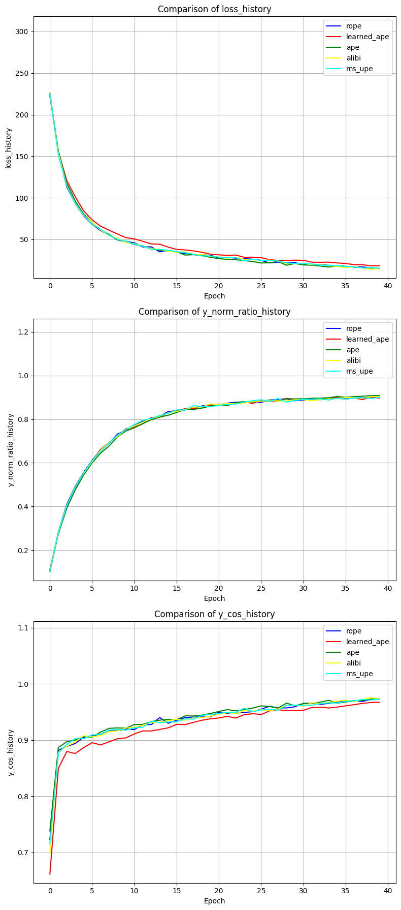
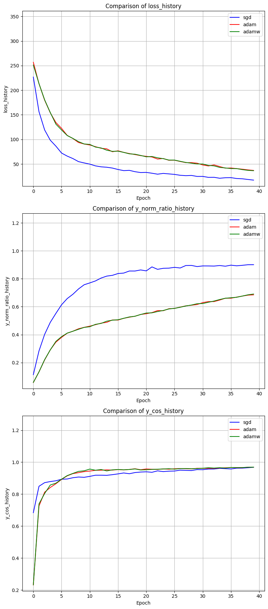
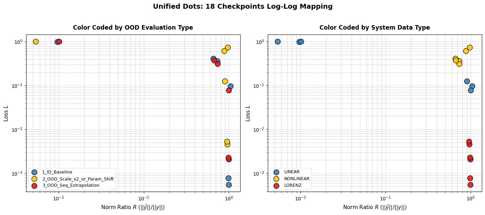

# Looped Transformer：机制消融与动力学分析

对 **Looped Transformer**（所有层共享权重、循环迭代的 Transformer 变体）的穷尽式机制消融
与动力学分析框架。下游任务覆盖**线性回归、非线性回归、Lorenz 混沌系统下一帧预测**三大场景，
支持 curriculum learning、Muon/Nora 混合优化器、OOD 泛化评估、checkpoint 断点续训。

> 由原 `Looped_Transformer.ipynb` 拆解而来，以可维护的小 `.py` 文件为主，便于增量修改。

## 目录

1. [理论](#理论)
2. [模块拼装](#模块拼装)
3. [目录结构](#目录结构)
4. [快速启动](#快速启动)
5. [实验框架：ExperimentTable](#实验框架experimenttable)
6. [实验脚本](#实验脚本)
7. [已完成实验的发现](#已完成实验的发现)
8. [Web 监控面板](#web-监控面板)
9. [依赖](#依赖)
10. [待完成与未来工作](#待完成与未来工作)

---

## 理论

### 循环迭代与残差门控

所有层共享同一组权重 $\theta$，每层的输入是前一层输出与初始输入的加权组合：

$$
\begin{aligned}
h_0 &= \text{input} \\
h_l &= \text{TransformerBlock}(a \cdot h_{l-1} + b \cdot h_0 \mid \theta) \quad l=1,2,\dots,L
\end{aligned}
$$

$(a, b)$ 为**残差门控**（`residual_gate`），控制当前状态与原始输入之间的信息流，可为固定值、
可学习标量或可学习逐维向量。

### 截断损失（防梯度爆炸）

只让最后 $T$ 层参与损失计算与梯度回传，前 $L-T$ 层在边界处 `detach()` 释放计算图：

$$\text{Loss}(\theta)=\mathbb{E}\left[ \frac{1}{L-b_0} \sum_{t=b_0}^{L} \frac{1}{k+1} \sum_{i=0}^{k} (Y_t(P^i \mid \theta) - f(x_{i+1}))^2 \right]$$

- $T$ 即有效层数 `num_eff`，$b_0 = \max(L - T, 0)$；
- 可选的 `layer_weight_decay` / `seq_weight_decay` 对不同层 / 不同序列位置做指数加权。

### Curriculum Learning（打破"d_x 之墙"）

高维线性回归下 loss 极难下降（"d_x 之墙"）。Curriculum 在训练前 `duration_ratio` 比例的步数内，
从低维短序列起步、线性放大到目标 `(d_x, seq_len)`，有效打破这堵墙：

```python
curriculum = {'d_x': 5, 'seq_len': 10, 'duration_ratio': 0.8}
```

> 注意：Lorenz 的 `d_x=3` 是物理维度不能变，curriculum 只演进 `seq_len`。

### 下游任务

| 任务 | 数据生成 | 维度 |
|---|---|---|
| 线性回归 | $y = x^\top w$，每 batch 采样 $w \sim \mathcal{N}(0, I/d_x)$ | $d_x=20, d_y=1$ |
| 非线性回归 | $y = w_2 \cdot \sigma(w_1 \cdot x)$，$\sigma$ 可换 | $d_x=20, d_y=1, d_{hidden}=64$ |
| Lorenz | RK4 积分 Lorenz 方程，下一帧状态预测 | $d_x=3, d_y=3$ |

Prompt 统一为交织序列 $(x_1, y_1, \dots, x_k, y_k, x_{test})$，取最后一层输出的倒数第二 token 作预测。
GPT-2 风格初始化（`init_std`）+ `ln_f` 兜底归一化 + 残差输出层缩放（`std_res = init_std / sqrt(2L)`）。

---

## 模块拼装

```
Looped Transformer 实验台
├── core/                             # 🟢 写定的底层积木（稳定层）
│   ├── position_encoding.py          # APE / LearnedAPE / ALiBi / RoPE / MS_UPE（自创多尺度解绑）
│   ├── swiglu.py                     # SwiGLU（与 nn.GELU 并列的 FFN 激活）
│   ├── probes.py                     # AttentionProbe（捕获注意力矩阵）/ SinkMetricsProbe（sink score/rate）
│   ├── lorenz.py                     # Lorenz 底层动力学：导数 / RK4 / kernel / 离线池化
│   ├── optimizers.py                 # HybridOptimizer（多优化器包装）+ Nora（正交化优化器）
│   └── print_vram_usage.py           # 跨平台显存监控（MPS/CUDA/CPU）
├── attention.py                      # MultiHeadAttention（PE 分发 + 训练 fused / 推理捕获）
├── transformer_block.py              # Pre-Norm Block（LayerNorm/RMSNorm + MHA + GELU/SwiGLU）
├── toy_model.py                      # Looped 引擎（权重共享、残差门控、num_eff 截断、x_init、probe 集成）
├── regression.py                     # RegressionHead（双通道投影+拉链交织）/ PredictionLoss（ln_f+加权）/ Solver
├── data_generators.py                # linear / nonlinear / lorenz 三个 *_data_generator + lorenz 缓存
├── dataloader.py                     # 按 data_type 统一分发 + sink padding
├── experiment.py                     # LoopedTransformerExperiment（训练/评估/检查点/结果收集）
├── experiment_table.py               # ExperimentTable（多实验调度 + 自动绑图）
└── default_setup.py                  # default_setup()：集中管理的默认参数字典
```

**包内依赖链**（无环）：`core/`（独立积木）→ `attention` → `transformer_block` → `toy_model` → `regression`
→ `experiment` → `experiment_table`；`data_generators`（用 `core.lorenz`）→ `dataloader` → `experiment`；
`default_setup` → `experiment_table`。

顶层 `__init__.py` 再导出全部公开 API，使用体验扁平：`from looped_transformer import ExperimentTable, ToyModel, ...`。

---

## 目录结构

```
Looped_Transformer/
├── looped_transformer/        # 核心包（见上"模块拼装"）
│   └── core/
├── experiments/               # 实验脚本（每个一个主题，沉淀"怎么配参"的经验）
│   ├── linear/                # 线性回归各项消融
│   ├── nonlinear/             # 非线性回归
│   ├── curriculum/            # 三任务 curriculum + 统一分析
│   ├── lorenz/                # Lorenz 消融 + 3D rollout
│   └── optuna/                # 超参搜索
├── src/                       # 旧入口与独立脚本（历史保留，已被 experiments/ 替代）
│   ├── main.py                #   旧 PE 对比入口
│   └── lorenz/lorenz_attractor_anim.py  #   Lorenz 吸引子动画 GIF 生成器
├── web_monitor/               # FastAPI 实时监控面板（server.py + index.html）
├── data/lorenz/               # Lorenz 离线轨迹池（gitignored，由脚本生成）
├── saved_checkpoints/         # 训练 checkpoint（gitignored）
├── figures/                   # 实验输出图（gitignored）
├── Looped_Transformer.ipynb   # 原始 notebook（权威对照）
├── Looped_Transformer.pdf     #   notebook 导出的 PDF
├── Looped Transformer 实验进展报告.md   #   实验进展报告（MD）
├── Looped Transformer 实验进展报告.pdf  #   实验进展报告（PDF）
├── run_monitor.sh             #   Web 监控面板一键启动
├── requirements.txt
├── LICENSE
└── README.md
```

---

## 快速启动

```bash
# 安装依赖（用 uv pip）
uv pip install -r requirements.txt
# 或：pip install -r requirements.txt

# 跑一个最小实验（线性 PE 对比）
python experiments/linear/pe_compare.py
```

设备自动检测 **MPS > CUDA > CPU**。每个实验脚本独立可跑，图存到 `figures/<分类>/`。

最小用法（库代码）：

```python
from looped_transformer import ExperimentTable

table = ExperimentTable(params_groups=[
    {'pe_type': ['alibi'], 'experiment_name': 'ALiBi'},
    {'pe_type': ['rope'],  'experiment_name': 'RoPE'},
])
table.run(result_lists=[(['loss_history'], 'epoch')])
table.plot()
```

---

## 实验框架：ExperimentTable

`ExperimentTable` 是多实验对比的核心调度器。底层逻辑是"全量默认 + 局部覆写"：
`default_setup()` 提供所有默认值，`params_groups` 中只写要改的 key，`manual` 全局覆写。

### 核心流程

1. `__init__(params_groups, manual=None)` — 加载默认参数、逐实验覆写、构造所有实验对象。
2. `run(result_lists, modes=['train'], parallel_workers=1, eval_configs=None)` — 执行。
3. `plot(compare_experiments, subplot_shape, figure_size, ...)` — 渲染对比图。

### result_lists 格式（支持双 Y 轴与多横轴）

```python
result_lists = [
    # 折线：横轴 epoch
    (['loss_history'], 'epoch'),
    # 柱状图：横轴 experiment（metric 为单值）
    (['final_loss', 'final_y_pred_norm', '|', 'final_residual_gate_a'], 'experiment'),
    # 双 Y 轴：'|' 左侧绑左轴，右侧绑右轴
    (['loss_history', '|', 'residual_gate_history_a'], 'epoch'),
    # baseline：第 3 项为基线索引（0-based），画相对差值
    (['loss_history'], 'epoch', 0),
    # block 横轴：仅限 eval 与 captured 的 sink 指标
    (['1_ID_Baseline_sink_scores', '2_OOD_Param_Shift_sink_scores'], 'block'),
]
```

### params_groups 格式

所有可覆写参数见[可覆写参数一览](#可覆写参数default_setup)。`ExperimentTable.__init__` 接收 `params_groups`（实验列表）和可选的 `manual`（全局覆写）。

```python
# 模板：[ {实验1字典}, {实验2字典}, ... ]
#   最外层 []  = 实验列表
#   里面 {}    = 每个实验的参数字典

params_groups = [
    # 实验 1
    {
        'experiment_name': '基线',           # 必填：实验名称
        'pe_type': ['learned_ape'],          # ⚠️ 就算只有一个 PE，也必须用中括号 []
        'residual_gate': (1, 1),             # 门控初始值用小括号 ()
    },
    # 实验 2
    {
        'experiment_name': 'OOD测试',
        'pe_type': ['ms_upe', 'alibi'],      # 多个 PE 用逗号隔开，套在中括号 [] 里
        'residual_gate': 'random',           # 字符串直接写
        'residual_gate_type': 'learnable_scalar',
    },
]
```

### run 参数

| 参数 | 类型 | 默认 | 说明 |
|---|---|---|---|
| `result_lists` | `list[tuple]` | 必填 | 见上 |
| `modes` | `list[str]` | `['train']` | `'train'` 和/或 `'evaluate'` |
| `parallel_workers` | `int` | `1` | 并行线程数（>1 多线程压测） |
| `eval_configs` | `list[dict]` | `None` | 评估配置，如 `[{'eval_name':'id','ood_kwargs':{}}, {'eval_name':'ood','ood_kwargs':{'x_scale':2.0}}]`。`eval_name` 作结果 key 前缀 |

### plot 参数

| 参数 | 默认 | 说明 |
|---|---|---|
| `compare_experiments` | `True` | True：同指标跨实验横向对比；False：每实验独立子图（`'|'` 双 Y 轴） |
| `subplot_shape` | `(1,-1)` | 子图网格，-1 自动计算 |
| `figure_size` | `None` | None 时取 `(8*cols, 6*rows)` |
| `suptitle` | `'Looped...'` | 顶部标题 |

### 可覆写参数（default_setup）

按模块分组（摘录，完整见 `looped_transformer/default_setup.py`）：

| 模块 | 关键 key |
|---|---|
| MultiHeadAttention | `num_heads`, `d_model`, `max_seq_len`, `pe_type` |
| TransformerBlock | `norm_type`, `ffn_type` |
| ToyModel | `num_blocks`, `loop`, `residual_gate`, `residual_gate_type`, `x_init`, `sink_threshold` |
| RegressionSolver | `d_x`, `d_y`, `init_std`(`'auto'`/float/None), `layer_weight_decay`, `seq_weight_decay` |
| LoopedTransformerExperiment | `lr`, `lr_muon`, `lr_nora`, `gate_lr_ratio`, `optimizer_type`(`'muon_adamw'`/`'nora_adamw'`/...), `seed`, `load_path`(`'auto'`) |
| dataloader | `batch_size`, `seq_len`, `sink_padding`, `d_hidden`, `function_callable`, `lorenz_kwargs`, `load_lorenz_from` |
| train | `epochs`, `steps_per_epoch`, `data_type`, `scheduler_type`, `eta_min`, `scheduled_training`, `curriculum`, `save_path`(`'auto'`) |

### 可用指标一览

`get_results()` 返回的全部 metric key（`result_lists` 里可用的名字）：

**训练过程指标**（横轴 `epoch`，值为 `list[float]`）：

| 指标 | 说明 |
|---|---|
| `loss_history` / `y_pred_norm_history` / `y_true_norm_history` | 损失 / 预测范数 / 真实范数 |
| `y_norm_error_history` / `y_norm_ratio_history` / `y_norm_ratio_abs_history` | 范数差 / 范数比 / 范数比偏差 |
| `y_cos_history` / `y_cos_1_history` | 预测与真实的余弦相似度 / 其补数 |
| `sink_score_history` / `sink_rate_history` | 注意力向位置 0 集中的程度 |
| `residual_gate_history_a/b`（标量）/ `_mean`/`_std`（向量）/ `_relative` 变种 | 残差门控 (a,b) 及其相对初值的变化 |
| `captured_sink_scores` / `captured_sink_rates` / `captured_attention` | 最后一次前向捕获的逐层值 |

**汇总指标**（横轴 `experiment`，单值）：`final_loss`、`final_y_pred_norm`、`final_y_true_norm`、`final_sink_score`、`final_sink_rate`、`final_residual_gate_a/b`（及 `_mean`/`_std`）、`init_time`、`train_time`。

**评估指标**（前缀 `{eval_name}_`，来自 `eval_configs`）：`{eval_name}_loss`、`_y_pred_norm`、`_y_true_norm`、`_y_norm_ratio`、`_y_norm_ratio_abs`、`_y_cos`、`_y_cos_1`、`_sink_scores`（横轴 `block`）、`_sink_rates`、`_captured_attention`。

### 绑图逻辑详解

**`compare_experiments=True`（横向对比，默认）**：一张子图 = 一个指标，所有实验同图对比。一个 `result_list` 里写多个指标时自动拆成多张子图（不会把不同量级的指标塞一张图）。

**`compare_experiments=False`（独立模式）**：一张子图 = 一个实验 × 一个指标组。`result_list` 中 `'|'` 左侧的指标绑左轴，右侧绑右轴（`twinx`）；不要把量级差异大的指标都放同一侧。

**横轴类型**：
- `'epoch'`：训练过程折线（metric 须为 `list`）；
- `'block'`：模型深度折线，仅限 eval 的 `*_sink_scores` / `*_sink_rates`（逐层 captured）；
- `'experiment'`：汇总柱状图（metric 为单值）。

**baseline 相对值**：`result_list` 第三项指定基线索引，画相对差值（基线标 `(Baseline)`）。

**总子图数**：

| 模式 | 总数 |
|---|---|
| 对比（True） | Σ(每条 result_list 中 `'|'` 之外的指标数) |
| 独立（False） | 实验数 × Σ(每条 result_list 的指标组数) |

### 常见报错

| 报错 | 原因 |
|---|---|
| `ValueError: Unknown parameter: {key}` | params_groups 拼错 key |
| `pe_type` 格式错误 | 必须用列表 `['ape']`，不能是字符串 |
| 请求的指标被静默忽略 | metric 名须与 `get_results()` 返回的 key 完全一致 |

---

## 实验脚本

每个脚本顶部注释块写明**实验目的 + 关键配置 + 为什么这么配**（参数是试出来的）。

| 脚本 | 主题 |
|---|---|
| `experiments/linear/observations.py` | loss 曲线 + 范数观测（含 curriculum 打破 d_x 之墙） |
| `experiments/linear/scheduled_vs_non.py` | Scheduled Training 对比 |
| `experiments/linear/pe_compare.py` | 5 种 PE + 叠加对比（ALiBi 为基线） |
| `experiments/linear/sink_padding.py` | sink padding 消融 |
| `experiments/linear/residual_gate.py` | 残差门控类型/初值消融 + 漂移观测 |
| `experiments/linear/scheduler.py` | None/Cosine/Step 调度器对比 |
| `experiments/nonlinear/regression.py` | 非线性回归训练观测（loss/norm/gate 双 Y 轴） |
| `experiments/curriculum/linear.py` | 线性 curriculum + ID/OOD 评估（训-存-载-评） |
| `experiments/curriculum/nonlinear.py` | 非线性 curriculum + ID/OOD 评估 |
| `experiments/curriculum/lorenz.py` | Lorenz curriculum + ID/Param-Shift/Seq 评估 |
| `experiments/curriculum/unified_analysis.py` | 三任务统一 OOD 分析 + log-log 散点图 |
| `experiments/lorenz/ablation.py` | Lorenz 8 维消融（PE/optim/scheduled/scheduler/heads/ffn/loop/norm） |
| `experiments/lorenz/eval_3d.py` | Lorenz 闭环自回归 1000 步 rollout 的 3D 轨迹（ID + OOD） |
| `experiments/optuna/hpo.py` | Lorenz 多目标超参搜索 + 消融热力图 |

---

## 已完成实验的发现

从 commit 历史与实验报告提炼的关键结论（参数都是试出来的）。

### 1. Scheduled Training vs Non-Scheduled


**发现**：渐进式增加有效层数（Scheduled Training）的初期 loss 更低更稳，长期收敛点相近——故默认 `scheduled_training=False`。

### 2. 位置编码对比（5 种 PE）


**发现**：ALiBi 综合最优；score/QK 层面注入（ALiBi/RoPE）优于输入端（LearnedAPE）；MS-UPE + LearnedAPE 叠加**无益**。在循环架构中，在 score/QK 层面注入位置信息优于仅在输入端加入。

### 3. Sink Padding 消融


**发现**：各组曲线高度重叠，sink padding 对最终 Loss 没有决定性正面影响——默认 `None`。

### 4. 残差门控消融


**发现**：所有门控配置收敛水平接近，对初始值不敏感；可学习门控的 a/b 漂移幅度 < 0.2，模型倾向维持接近初始值的门控策略。

### 5. Curriculum Learning（打破"d_x 之墙"）


**发现**：从低维短序列起步、逐步放大的 curriculum 有效打破高维线性回归的"d_x 之墙"；
在 nonlinear 和 Lorenz 任务上同样显著提升收敛速度与最终精度。

### 6. Lorenz 消融





**发现**：与线性任务相反，`ms_upe + alibi` 叠加在此任务有效；muon_adamw + swiglu + cosine 为最佳组合。

### 7. 收缩吸引子定理

MSE loss 下，Looped Transformer 必然收敛到 shrinkage estimator（λ\*≈0.5–0.7）——模型"学会"了在预测方差与偏差之间做最优权衡。

### 8. OOD 标度律



loss 与 norm ratio 满足跨任务幂律 `L = A·R^B`，在 linear/nonlinear/Lorenz 三任务、多种 OOD 场景下验证。

---

## Web 监控面板

基于 FastAPI + 纯 HTML/ECharts 的实时训练监控面板（`web_monitor/`），零侵入——通过劫持
`sys.stdout` + 正则提取 Epoch/Loss，再经 WebSocket 推送，不改任何库代码。

**启动**：

```bash
bash run_monitor.sh
# 浏览器打开 http://localhost:8000
```

**功能**：动态参数配置（侧边栏增删实验卡片）、一键加载基线、实时 Loss 曲线（WebSocket + EMA 平滑）、
安全中断（`ctypes` 向训练线程注入异常 + 自动 offload）、训练完结果原地展示、Compare 模式（ON 横向对比 / OFF 双 Y 轴）、可拖动布局。

**架构**：浏览器（`index.html`）↔ FastAPI（`server.py`），训练在独立线程（`asyncio.to_thread`），
`StdoutHijacker` → 线程安全队列 → 异步桥 → WebSocket。

---

## 依赖

| 用途 | 包 |
|---|---|
| 核心训练 | `torch>=2.10`（用 `torch.optim.Muon`）、`numpy`、`matplotlib` |
| 实验脚本 | `optuna`、`pandas`、`seaborn` |

```bash
uv pip install -r requirements.txt
```

> Nora 优化器已迁入 `looped_transformer/core/optimizers.py`，不是 pip 包。
> Lorenz 离线数据池由 `create_lorenz_pool()` 生成（约 2.4GB，gitignored）；缺失时自动 fallback 到实时 RK4。

---

## 待完成与未来工作

按上手难度从低到高排列。每个任务均标注了状态与涉及的文件。

### A. 开箱即用

无需改代码，直接用 `ExperimentTable` 跑。

#### 全参数扫描 ✅ 已实现

利用 `ExperimentTable` 对任意参数进行对比实验：离散参数枚举取值 → `run()` → `plot()`；
连续参数已通过 Optuna 搜参（见 `experiments/optuna/hpo.py`）。

### B. 少量扩展

#### 两处 pass 补全 ✅ 已实现

`plot()` 中已支持实验汇总柱状图（横轴 `'experiment'`）和评估结果画图（`modes=['evaluate']`）。

#### 首 loss 归一化

新增 `plot()` 选项，将每条 loss 曲线除以其首个 epoch 值，消除初始尺度差异，只看相对下降幅度。

#### 分头 attention 可视化

利用已有的 `AttentionProbe` 捕获的 `captured_attention`，按头切片画热力图，观察不同头的注意力模式差异。

#### 模型探针

在 `ToyModel` 各层插入线性探针，检测模型在何时学会线性回归的闭式解 $w = (X^TX)^{-1}X^Ty$。

#### Grokking 观察

在大显存设备上增大 `epochs` 和 `batch_size`，观察是否出现顿悟现象（loss 长时间不降后突然收敛）。

### C. 新模块开发

需要新建模块或对核心架构做较大改动。

#### 画梯度下降图

在 `experiment.py` 训练循环中收集梯度范数或参数变化轨迹，新增可视化模块画参数空间中的优化路径。

#### 添加归纳偏置

在 `toy_model.py` 或 `transformer_block.py` 中引入结构性先验：正交/恒等初始化、低秩分解、门控范围约束等。

#### 新任务扩展

- 逻辑推理任务（离散序列预测等）
- 更多物理系统（ODE 生成器——目前 Lorenz 已支持，可扩展双摆、Van der Pol 等）

#### ExperimentTable GUI ✅ 已实现

见上方 [Web 监控面板](#web-监控面板)。基于 FastAPI + HTML/ECharts，
支持参数配置、基线加载、实时 Loss、安全中断、EMA 平滑、Compare 模式。
